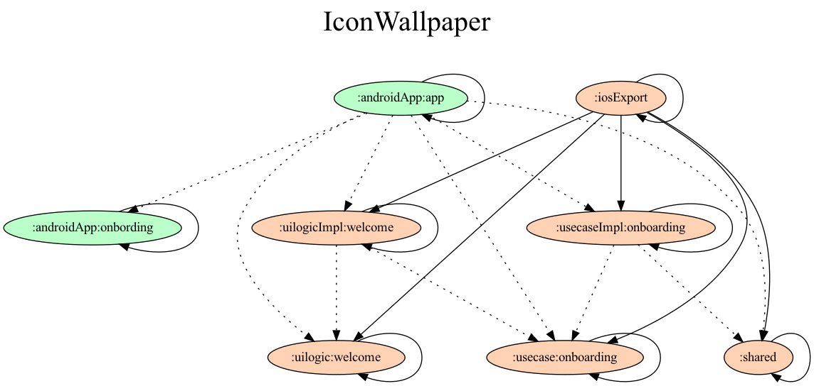

# モジュール



<details close>
  <summary>グラフの更新方法</summary>
  
  まず、必要なファイルをダウンロードします。
  ```
    ./gradlew downloadProjectDependencyGraphGradle
  ```

  ファイルのダウンロードができたら、 `gradle.properties` を変更してGradleタスクを実行します
  ```
    // gradle.properties
    project.applyProjectDependencyGraph=true
  ```

  ```
    ./gradlew projectDependencyGraph
  ```

  タスクが完了すると `/IconWallpaper/build/reports/dependency-graph/` 下にグラフが出力されています。
</details>